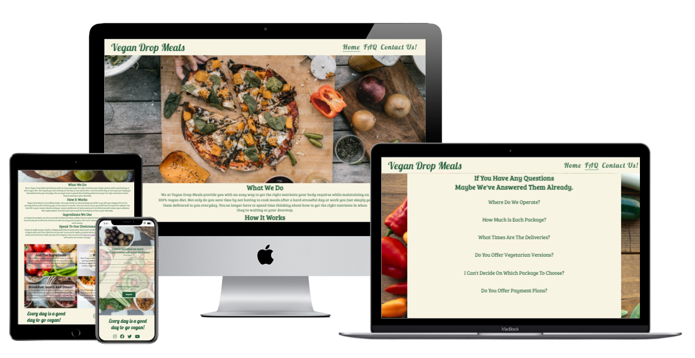
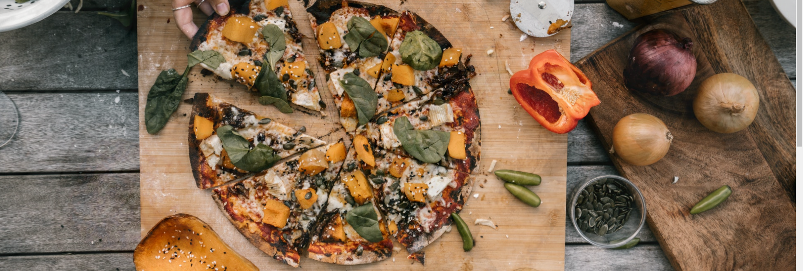
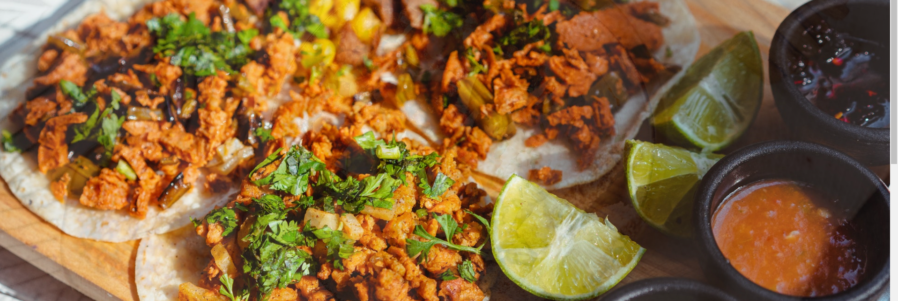

# **Vegan Drop Meals**
Vegan drop meals is a meal delivery service that currently covers areas in Dublin,Galway and Cork. Vegan Drop Meals aims to provide an easy way for people to transition to a plant based diet and to give people the right amount of calories and nutrients to sustain all their activities. This site will target people who want to turn to a plant-based, vegan or vegetarian diet.\
 It will also target people who already are o0n one of these diets but struggle to find time to cook or get the right nutrients into their body which is extremely common in any of these diets. As meat is a HBV protein it provides you with all the protien you need Vegan Drop Meals will provide you with the right amount of different LBV proteins as those are present in vegetables.
 
 ## Features:
 - **Navigaton bar**
   - The navigation bar is exactly the same on all three of the Vegan Drop Meals website allowing users to easily navigate back to the home page or anywhere in the website.
   - The logo and the navigation menu are all the same across the website with resposive elements showing them what specific page they are on.

- **Landing Page**
  - The landing page is a slideshow of images that allows the viewer to see the different meals that Vegan Drop Meals offers.
  - The slideshow will allow viewers to quickly identify the website is a meal delivery service.
  - The animation of a slideshow will grab the users attention as they aren't bored of a single image placed in the landing page.
  - This features five different images to allow the user to see a different image each time.

