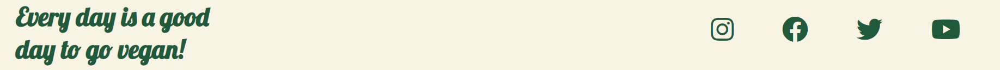

# **Vegan Drop Meals**
Vegan drop meals is a meal delivery service that currently covers areas in Dublin,Galway and Cork. Vegan Drop Meals aims to provide an easy way for people to transition to a plant based diet and to give people the right amount of calories and nutrients to sustain all their activities. This site will target people who want to turn to a plant-based, vegan or vegetarian diet.

 It will also target people who already are on one of these diets but struggle to find time to cook or get the right nutrients into their body which is extremely common in any of these diets. As meat is a HBV protein it provides you with all the protien you need Vegan Drop Meals will provide you with the right amount of different LBV proteins as those are present in vegetables.

 

 ## Features Of Page:

 - **Navigaton Bar**

   - The navigation bar is exactly the same on all three of the Vegan Drop Meals website allowing users to easily navigate back to the home page or anywhere in the website.
   - The logo and the navigation menu are all the same across the website with resposive elements showing them what specific page they are on.

- **Landing Page**

  - The landing page is a slideshow of images that allows the viewer to see the different meals that Vegan Drop Meals offers.
  - The slideshow will allow viewers to quickly identify the website is a meal delivery service.
  - The animation of a slideshow will grab the users attention as they aren't bored of a single image placed in the landing page.
  - This features five different images to allow the user to see a different image each time.

- **About Section**

  - The about section aims to provide a quick description of the service that vegan drop meals provides and how to contact the deiticians and get started on the plan.
  - The section also aims to give an iinsight into the service and the ingredients used.
  - The about section features a link inside the contact our dieticians section that will allow users to wuickly navigate the website without having to go to the top of the page.

- **Packages Section**

  - The packages section gives the user a simple breakdown of the four packages that are provided by Vegan Drop Meals. It allows them to easily compare the packages and choose the best one that suits them.
  - The packages section has a hover element that makes the package they hover over stand out compared to the other packages but this is only present in devices over 1150px wide, as smaller devices are usually touch screen and it would not be viable.
  - Each package and background image of the package is a clickable link which also expands when hovered. This will allow the user to easily choose a package and be transfered to the contact us page.

- **The Footer**

  - The footer has an extremely minimalistic design which incorporates to the flow of the website by not changing colors and matching the color scheme.
  - There is four icons that link to different social media platforms being Instagram, Facebook, Twitter and Youtube.
  - The inspirational message is designed to be discrete yet promote the move to a vegan or plant based diet.

- **The FAQ Page**
  
  - The FAQ section is a retractable accordion style section that allows users to only see the answers for questions that they want answered.
  - The accordion style design will reducce frustration for the user when they just want an answer to one question.
  - This section aims to inform the user about the different options and answer any questions that they may need an answer for before deciding to contact us.

- **Contact Us Page**

  - The contact us page is designed to be simple and easy to use like the rest of the website. The user has to fill out a form that requires basic information for them to be    contacted.
  - The inclusion of a preferred way of contact is to promote easy access for people generally anxious of phone calls. This will allow the user to have a positive experience   with Vegan Drop Meals and a none stressful way to contact the dieticians.
  - The phone number has a set limit of characters to prevent any false numbers being input to the field.

- **Features left to implement**

  - **Back To Top Button**

    - A back to top button would improve UX allowing a quick and easy return to the navigation bar to browse the different sections of the website.
    - It would also reduce frustration as scrolling tends to be tedious and can cause a user not to return to the website.

  - **Why Vegan Page**
  
    - A Why Vegan page would further encourage users to change their diet. This page would be dedicated to studies done and health benefits of a plant based diet.
    - This would allow users to gather information on a vegan or plant based diet in one source without having to travel to other websites or look for the information themselves. This would make the website more beneficial to the user and promote the service itself.

## **Testing** 

### **Website Functionality Testing**

- **Links Testing**:
  - I tested all my links in my website and realised that my packages weren't linked to my contact us page.
  - **Fix**: I replace the current placeholder # with the right href to link to contact us page.

  - All other links are functional and links to external sites in the footer open in a new tab.

- **Form Testing**
  - During the testing of my form I realised my Phone number input only allowed for ten characters and required at least 13 with dashes inbetween each 3 number.
  - **Fix**: I removed the dashes inbetween the allowed pattern of numbers and increased my max-length to 14 to allow for prefixes like +353.

  - My Enquire button did not have a hover attribute and when hovered over did not look clickable.
  - **Fix**: I added a hover attribute in my CSS file making the button change color and improving UX making it easier to recognise as a button.